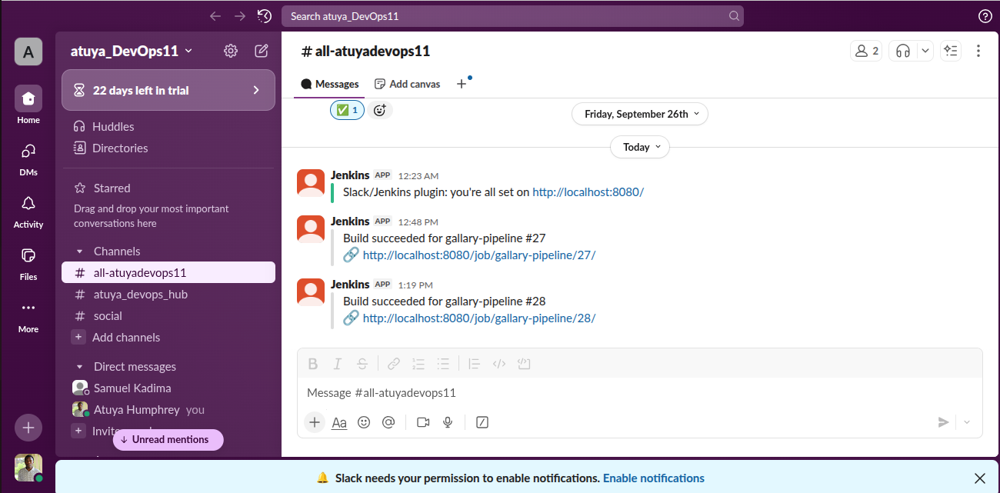

#### Continuous Deployment Pipeline Overview

This project demonstrates a Continuous Deployment (CD) pipeline built with Jenkins to automate the full software delivery process — from code commit to live deployment. Once a push is made to the main branch on GitHub, a configured webhook triggers the Jenkins pipeline automatically.

#### Key Features

  - Cloning of a GitHub repository
  - Installation of required Node.js dependencies
  - Execution of automated integration tests
  - Continuous Deployment (CD) to Render upon successful test completion
  - Slack integration for build and deployment notifications
   

#### Requirements to Run Project Locally

- Node.js v18+
- npm
- Database: MongoDB Atlas
- Jenkins
- ngrok 
- Github webhook
- Slack 

---

#### Setup Instructions

Follow the following steps to run this project locally

1. Fork the repository to your Github account.
2. Clone the forked repository
   ```bash
     git clone https://github.com/atuyabirisi/gallery.git
   ```
3. Install Dependencies
   ```bash
     npm install
   ```
4. Configure Environment Variables
   Create a .env file at the root of the project and set the following variables

   ```bash
     NODE_ENV=<development | test | production
     PORT=<port number>
     DB_URL_DEV=<your_mongodb_connection_string>
     DB_URL_PROD=<your_production_mongodb_connection_string>
     DB_URL_TEST=<your_test_mongodb_connection_string>
   ```
5. Install Jenkins locally and Slack Notificaiton plugin
6. Expose Jenkins with ngrok
7. Configure Github Webhook with:
    - payload url = ngrok-jenkins-url/github-web-hook/
    - content type = application/json
    - Trigger - just the push event
8. Push to git to trigger pipeline 
9. View success or failure notifications on slac channel

#### Deployment url
[deploment url](https://devops-ip-1.onrender.com/)

#### Real-time slack channel notification sample

